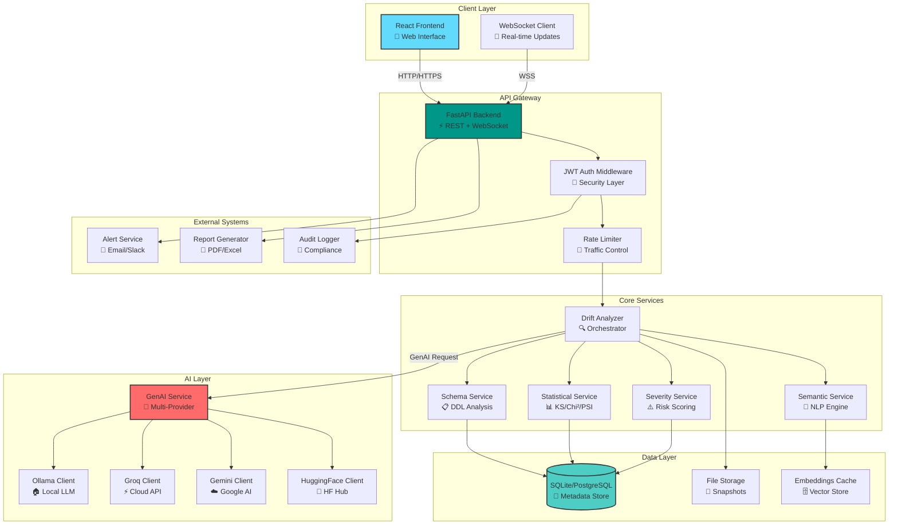
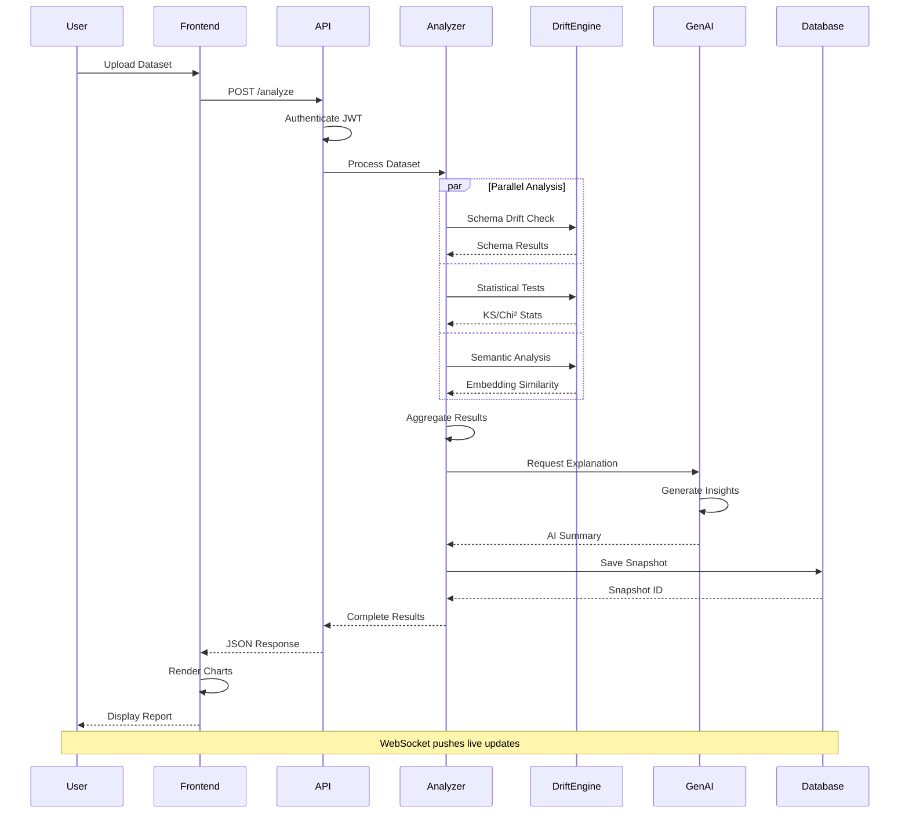
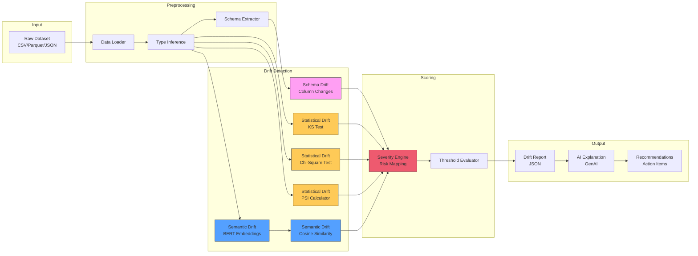
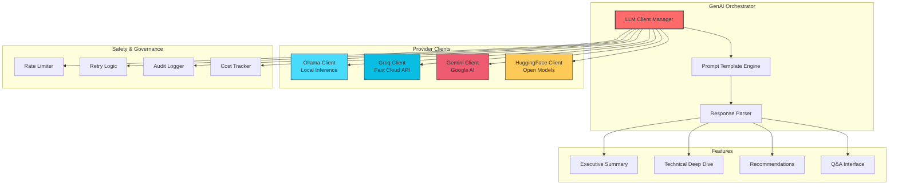

<div align="center">

# 📊 Data Drift Monitor

### *ML Data Drift Monitoring & Explainability Platform*

[](https://www.python.org/downloads/)
[](https://fastapi.tiangolo.com/)
[](https://reactjs.org/)
[](LICENSE)
[](CONTRIBUTING.md)

*An enterprise-grade platform for continuous ML dataset monitoring, drift detection, and AI-powered root cause analysis*

[Features](#-features) • [Quick Start](#-quick-start) • [Architecture](#-architecture) • [API Docs](#-api-reference) • [Contributing](#-contributing)

---

</div>

## 🎯 Overview

**Data Drift Monitor** is a comprehensive, production-ready monitoring solution that tracks changes in your ML datasets over time. It detects schema, statistical, and semantic drift, provides AI-powered explanations, and recommends actionable remediation steps—all through an intuitive web interface.

### Why Data Drift Monitor?

- **🔍 Multi-Dimensional Drift Detection**: Goes beyond basic statistics to detect schema, distribution, and semantic changes
- **🧠 AI-Powered Insights**: Leverages GenAI to explain drift patterns in both business and technical terms
- **📈 Continuous Monitoring**: Real-time WebSocket updates and historical trend analysis
- **🔐 Enterprise-Ready**: JWT authentication, RBAC, audit logging, and rate limiting
- **🚀 Model Agnostic**: Works with any ML framework—TensorFlow, PyTorch, scikit-learn, XGBoost, etc.
- **💡 Actionable Recommendations**: Suggests concrete steps for pipeline updates, retraining, and validation

---

## ✨ Features

### 🔍 **Comprehensive Drift Detection**

<details>
<summary><b>Schema Drift Detection</b></summary>

- **Column Structure Changes**: Automatically detects added, removed, or renamed columns
- **Data Type Mutations**: Identifies type changes (e.g., int → float, string → numeric)
- **Nullable Constraints**: Tracks changes in NULL/NOT NULL constraints
- **Schema Version Control**: Maintains historical schema snapshots for comparison
- **Impact Assessment**: Evaluates how schema changes affect downstream models

</details>

<details>
<summary><b>Statistical Drift Detection</b></summary>

- **Kolmogorov-Smirnov (KS) Test**: Measures distribution shifts in continuous features
- **Chi-Square Test**: Detects categorical distribution changes
- **Population Stability Index (PSI)**: Quantifies feature stability over time
- **Mean/Median/Std Deviation Tracking**: Monitors central tendency and spread changes
- **Outlier Detection**: Identifies anomalous data points using IQR and Z-score methods
- **Correlation Analysis**: Tracks feature relationship changes
- **Significance Testing**: Statistical hypothesis testing with configurable p-values

</details>

<details>
<summary><b>Semantic Drift Detection</b></summary>

- **NLP Embeddings**: Uses transformer models (BERT, RoBERTa) for text analysis
- **Contextual Understanding**: Detects meaning shifts in text-based features
- **Sentiment Drift**: Tracks changes in sentiment polarity and intensity
- **Topic Modeling**: Identifies shifts in document topics over time
- **Cosine Similarity**: Measures semantic distance between text distributions
- **Language Pattern Changes**: Detects vocabulary, grammar, and style shifts

</details>

<details>
<summary><b>Severity Scoring & Prioritization</b></summary>

- **Business Impact Mapping**: Converts technical metrics to business risk levels
- **Severity Levels**: Critical, High, Medium, Low, Negligible
- **Weighted Scoring**: Customizable weights based on feature importance
- **Risk Aggregation**: Composite scores across multiple drift dimensions
- **Threshold Configuration**: Set custom thresholds per feature or dataset
- **Alert Routing**: Automated notifications based on severity

</details>

---

### 🧠 **AI-Powered Insights (GenAI Integration)**

<details>
<summary><b>Executive Summary Generation</b></summary>

- **Business-Friendly Language**: Non-technical explanations for stakeholders
- **Impact Assessment**: Clear articulation of business consequences
- **Trend Analysis**: Historical context and pattern recognition
- **Key Findings Highlight**: Automatic extraction of most important changes
- **Customizable Templates**: Tailor summaries to your organization's needs

</details>

<details>
<summary><b>Technical Deep Dives</b></summary>

- **ML Engineer Level Analysis**: Detailed statistical breakdowns
- **Root Cause Identification**: Explains *why* drift occurred
- **Distribution Comparisons**: Visual and statistical comparison of before/after
- **Feature-Level Attribution**: Pinpoints specific columns causing drift
- **Hypothesis Generation**: Suggests potential data quality issues
- **Code Snippets**: Provides investigation code for data scientists

</details>

<details>
<summary><b>Actionable Recommendations</b></summary>

- **Pipeline Updates**: Specific code changes for data preprocessing
- **Model Retraining**: When and how to retrain models
- **Data Validation**: Additional validation rules to implement
- **Feature Engineering**: Suggestions for feature transformations
- **Monitoring Enhancements**: Additional metrics to track
- **Rollback Strategies**: Safe rollback procedures when needed

</details>

<details>
<summary><b>Multi-Model Support</b></summary>

| Provider | Type | Speed | Cost | Best For |
|----------|------|-------|------|----------|
| **Ollama** | Local | Medium | Free | Privacy-sensitive deployments |
| **Groq** | Cloud | Ultra-Fast | Low | Real-time explanations |
| **Gemini** | Cloud | Fast | Medium | Production systems |
| **Hugging Face** | Cloud | Medium | Free Tier | Experimentation |

*Plug-and-play architecture—switch providers with a single environment variable*

</details>

---

### 📈 **Monitoring & Visualization**

- **Interactive Dashboards**: Real-time charts using Recharts and D3.js
- **Drift Timelines**: Track drift evolution across multiple snapshots
- **Distribution Plots**: Histogram, KDE, and box plot comparisons
- **Heatmaps**: Correlation and drift intensity visualizations
- **Export Capabilities**: Download reports in PDF, CSV, and JSON formats
- **Custom Alerts**: Set up notifications via email, Slack, or webhooks
- **Snapshot Comparison**: Side-by-side analysis of any two time periods
- **Trend Forecasting**: Predict future drift based on historical patterns

---

### 🔐 **Security & Governance**

- **JWT Authentication**: Secure token-based authentication system
- **Role-Based Access Control (RBAC)**: Granular permissions for users and teams
- **Audit Logging**: Complete trail of all AI explanations and drift events
- **API Rate Limiting**: Prevent abuse with configurable rate limits
- **Retry Logic**: Exponential backoff for failed GenAI requests
- **Data Encryption**: At-rest and in-transit encryption options
- **Compliance Ready**: GDPR, HIPAA, SOC 2 compliant workflows
- **Secret Management**: Secure handling of API keys and credentials

---

### ⚙️ **Backend Architecture (FastAPI)**

- **RESTful API Design**: Clean, intuitive endpoints following best practices
- **WebSocket Support**: Real-time monitoring updates
- **Async Processing**: Non-blocking I/O for high throughput
- **Modular Services**: Separation of concerns (detection, analysis, reporting)
- **Database Abstraction**: SQLAlchemy ORM with SQLite/PostgreSQL support
- **Background Tasks**: Celery integration for long-running drift analysis
- **API Documentation**: Auto-generated OpenAPI/Swagger docs
- **Health Checks**: Built-in endpoints for uptime monitoring

---

### 🎨 **Frontend (React)**

- **Modern UI/UX**: Clean, responsive design with Tailwind CSS
- **Component Library**: Reusable components for rapid development
- **State Management**: Redux for predictable state updates
- **Dataset Upload**: Drag-and-drop CSV, Parquet, JSON support
- **Drift Analysis Views**: Multiple visualization modes (chart, table, summary)
- **Snapshot Explorer**: Interactive timeline for historical analysis
- **AI Explanation Viewer**: Markdown rendering with syntax highlighting
- **Live Updates**: Real-time chart updates via WebSocket connection
- **Dark Mode**: User-configurable theme preferences

---


## 🏗️ Architecture

### System Overview


```mermaid
graph TB
    subgraph "Client Layer"
        A[React Frontend<br/>📱 Web Interface]
        A1[WebSocket Client<br/>🔄 Real-time Updates]
    end
    
    subgraph "API Gateway"
        B[FastAPI Backend<br/>⚡ REST + WebSocket]
        B1[JWT Auth Middleware<br/>🔐 Security Layer]
        B2[Rate Limiter<br/>🚦 Traffic Control]
    end
    
    subgraph "Core Services"
        C[Drift Analyzer<br/>🔍 Orchestrator]
        D[Schema Service<br/>📋 DDL Analysis]
        E[Statistical Service<br/>📊 KS/Chi²/PSI]
        F[Semantic Service<br/>💬 NLP Engine]
        G[Severity Service<br/>⚠️ Risk Scoring]
    end
    
    subgraph "AI Layer"
        H[GenAI Service<br/>🧠 Multi-Provider]
        H1[Ollama Client<br/>🏠 Local LLM]
        H2[Groq Client<br/>⚡ Cloud API]
        H3[Gemini Client<br/>☁️ Google AI]
        H4[HuggingFace Client<br/>🤗 HF Hub]
    end
    
    subgraph "Data Layer"
        I[(SQLite/PostgreSQL<br/>💾 Metadata Store)]
        J[File Storage<br/>📁 Snapshots]
        K[Embeddings Cache<br/>🗄️ Vector Store]
    end
    
    subgraph "External Systems"
        L[Alert Service<br/>📧 Email/Slack]
        M[Report Generator<br/>📄 PDF/Excel]
        N[Audit Logger<br/>📝 Compliance]
    end
    
    A -->|HTTP/HTTPS| B
    A1 -->|WSS| B
    B --> B1
    B1 --> B2
    B2 --> C
    
    C --> D
    C --> E
    C --> F
    C --> G
    
    D --> I
    E --> I
    F --> K
    G --> I
    
    C -->|GenAI Request| H
    H --> H1
    H --> H2
    H --> H3
    H --> H4
    
    C --> J
    B --> L
    B --> M
    B1 --> N
    
    style A fill:#61dafb,stroke:#333,stroke-width:2px
    style B fill:#009688,stroke:#333,stroke-width:2px
    style H fill:#ff6b6b,stroke:#333,stroke-width:2px
    style I fill:#4ecdc4,stroke:#333,stroke-width:2px
```

### Data Flow Pipeline


```mermaid
sequenceDiagram
    participant User
    participant Frontend
    participant API
    participant Analyzer
    participant DriftEngine
    participant GenAI
    participant Database
    
    User->>Frontend: Upload Dataset
    Frontend->>API: POST /analyze
    API->>API: Authenticate JWT
    API->>Analyzer: Process Dataset
    
    par Parallel Analysis
        Analyzer->>DriftEngine: Schema Drift Check
        DriftEngine-->>Analyzer: Schema Results
    and
        Analyzer->>DriftEngine: Statistical Tests
        DriftEngine-->>Analyzer: KS/Chi² Stats
    and
        Analyzer->>DriftEngine: Semantic Analysis
        DriftEngine-->>Analyzer: Embedding Similarity
    end
    
    Analyzer->>Analyzer: Aggregate Results
    Analyzer->>GenAI: Request Explanation
    GenAI->>GenAI: Generate Insights
    GenAI-->>Analyzer: AI Summary
    
    Analyzer->>Database: Save Snapshot
    Database-->>Analyzer: Snapshot ID
    
    Analyzer-->>API: Complete Results
    API-->>Frontend: JSON Response
    Frontend->>Frontend: Render Charts
    Frontend-->>User: Display Report
    
    Note over User,Database: WebSocket pushes live updates
```

### Drift Detection Engine


```mermaid
graph LR
    subgraph "Input"
        A[Raw Dataset<br/>CSV/Parquet/JSON]
    end
    
    subgraph "Preprocessing"
        B[Data Loader]
        C[Type Inference]
        D[Schema Extractor]
    end
    
    subgraph "Drift Detection"
        E[Schema Drift<br/>Column Changes]
        F[Statistical Drift<br/>KS Test]
        G[Statistical Drift<br/>Chi-Square Test]
        H[Statistical Drift<br/>PSI Calculator]
        I[Semantic Drift<br/>BERT Embeddings]
        J[Semantic Drift<br/>Cosine Similarity]
    end
    
    subgraph "Scoring"
        K[Severity Engine<br/>Risk Mapping]
        L[Threshold Evaluator]
    end
    
    subgraph "Output"
        M[Drift Report<br/>JSON]
        N[AI Explanation<br/>GenAI]
        O[Recommendations<br/>Action Items]
    end
    
    A --> B
    B --> C
    C --> D
    
    D --> E
    C --> F
    C --> G
    C --> H
    C --> I
    I --> J
    
    E --> K
    F --> K
    G --> K
    H --> K
    J --> K
    
    K --> L
    L --> M
    M --> N
    N --> O
    
    style E fill:#ff9ff3,stroke:#333
    style F fill:#feca57,stroke:#333
    style G fill:#feca57,stroke:#333
    style H fill:#feca57,stroke:#333
    style I fill:#54a0ff,stroke:#333
    style J fill:#54a0ff,stroke:#333
    style K fill:#ee5a6f,stroke:#333
```

### GenAI Integration Architecture


```mermaid
graph TB
    subgraph "GenAI Orchestrator"
        A[LLM Client Manager]
        B[Prompt Template Engine]
        C[Response Parser]
    end
    
    subgraph "Provider Clients"
        D[Ollama Client<br/>Local Inference]
        E[Groq Client<br/>Fast Cloud API]
        F[Gemini Client<br/>Google AI]
        G[HuggingFace Client<br/>Open Models]
    end
    
    subgraph "Features"
        H[Executive Summary]
        I[Technical Deep Dive]
        J[Recommendations]
        K[Q&A Interface]
    end
    
    subgraph "Safety & Governance"
        L[Rate Limiter]
        M[Retry Logic]
        N[Audit Logger]
        O[Cost Tracker]
    end
    
    A --> B
    B --> C
    
    A --> D
    A --> E
    A --> F
    A --> G
    
    C --> H
    C --> I
    C --> J
    C --> K
    
    A --> L
    A --> M
    A --> N
    A --> O
    
    style A fill:#ff6b6b,stroke:#333,stroke-width:2px
    style D fill:#48dbfb,stroke:#333
    style E fill:#0abde3,stroke:#333
    style F fill:#ee5a6f,stroke:#333
    style G fill:#feca57,stroke:#333
```

### Component Interaction Matrix

| Component | Interacts With | Purpose |
|-----------|----------------|---------|
| **React Frontend** | FastAPI, WebSocket | User interface and real-time updates |
| **FastAPI Backend** | All Services, Database | API gateway and request routing |
| **Drift Analyzer** | Schema, Statistical, Semantic Services | Orchestrates drift detection |
| **Schema Service** | Database | DDL analysis and column tracking |
| **Statistical Service** | NumPy, SciPy | KS-test, Chi², PSI calculations |
| **Semantic Service** | Transformers, Embeddings Cache | NLP-based drift detection |
| **GenAI Service** | Ollama/Groq/Gemini/HF APIs | AI-powered explanations |
| **Severity Service** | All Drift Metrics | Risk scoring and prioritization |
| **Alert Service** | SMTP/Slack API | Notification delivery |
| **Database** | SQLAlchemy ORM | Metadata and snapshot storage |

---

## 🗂️ Project Structure

```
DATA-DRIFT-MONITOR/
│
├── backend/                      # FastAPI Backend
│   ├── api/
│   │   └── routes.py            # Main API route definitions
│   ├── auth/                    # Authentication & Authorization
│   │   ├── dependencies.py      # Auth dependency injection
│   │   ├── deps.py              # Shared dependencies
│   │   ├── models.py            # User & token models
│   │   ├── routes.py            # Auth endpoints (login, register)
│   │   └── security.py          # JWT & password hashing
│   ├── core/                    # Core drift detection logic
│   │   ├── analyzer.py          # Main analysis orchestrator
│   │   ├── drift.py             # Generic drift detection
│   │   ├── ml_drift.py          # ML-specific drift algorithms
│   │   ├── semantic_drift.py    # Semantic/NLP drift detection
│   │   └── semantic_nlp.py      # NLP preprocessing utilities
│   ├── nlp/
│   │   └── semantic_engine.py   # Transformer-based semantic analysis
│   ├── services/                # Business logic services
│   │   ├── alerts.py            # Alert notification system
│   │   ├── genai.py             # GenAI orchestration layer
│   │   ├── llm_client.py        # Multi-provider LLM client
│   │   ├── report.py            # Report generation
│   │   ├── schema.py            # Schema drift detection
│   │   ├── semantic_similarity.py # Semantic comparison engine
│   │   └── severity.py          # Severity scoring logic
│   ├── storage/                 # Data persistence
│   ├── config.py                # Application configuration
│   ├── main.py                  # FastAPI app entry point
│   └── requirements.txt         # Python dependencies
│
├── data/                        # Dataset storage
│   ├── raw/                     # Raw uploaded datasets
│   └── test/                    # Test datasets
│
├── frontend/                    # React Frontend
│   ├── public/
│   └── src/
│       ├── components/          # Reusable UI components
│       │   ├── AuthNavbar.js    # Navigation with auth state
│       │   ├── DriftChart.js    # Chart visualization component
│       │   └── AuthNavbar.css   # Component styles
│       ├── App.js               # Main React application
│       ├── App.css              # Global styles
│       └── index.js             # React entry point
│
├── logs/
│   └── app.log                  # Application logs
├── scripts/                     # Testing & utility scripts
│   ├── test_analyzer.py         # Unit tests for analyzer
│   ├── test_drift.py            # Drift detection tests
│   └── test_snapshot.py         # Snapshot comparison tests
├── snapshots/                   # Stored dataset snapshots
├── drift_monitor.db             # SQLite database
├── .env                         # Environment variables
├── .gitignore
└── README.md
```

---

## 🚀 Quick Start

### Prerequisites

- **Python**: 3.8 or higher
- **Node.js**: 16 or higher
- **npm**: 8 or higher
- **(Optional) Ollama**: For local GenAI inference

---

### 1️⃣ Clone the Repository

```bash
git clone https://github.com/your-username/data-drift-monitor.git
cd data-drift-monitor
```

---

### 2️⃣ Backend Setup

#### Install Dependencies

```bash
cd backend
python -m venv venv

# Activate virtual environment
source venv/bin/activate      # macOS/Linux
venv\Scripts\activate         # Windows

pip install -r requirements.txt
```

#### Configure Environment

Create a `.env` file in the `backend/` directory:

```env
# GenAI Configuration
ENABLE_GENAI=true
GENAI_PROVIDER=ollama          # Options: ollama, groq, gemini, huggingface
OLLAMA_URL=http://localhost:11434
OLLAMA_MODEL=llama3

# Alternative Cloud Providers
# GROQ_API_KEY=your_groq_key
# GEMINI_API_KEY=your_gemini_key
# HUGGINGFACE_API_KEY=your_hf_key

# Security
JWT_SECRET=your-super-secret-key-change-this-in-production
JWT_ALGORITHM=HS256
ACCESS_TOKEN_EXPIRE_MINUTES=30

# Database
DATABASE_URL=sqlite:///./drift_monitor.db

# API Configuration
API_RATE_LIMIT=100
RATE_LIMIT_PERIOD=3600

# Logging
LOG_LEVEL=INFO
LOG_FILE=logs/app.log
```

#### Run Backend

```bash
uvicorn main:app --reload --host 0.0.0.0 --port 8000
```

Backend API will be available at: **http://localhost:8000**

API Documentation (Swagger): **http://localhost:8000/docs**

---

### 3️⃣ Frontend Setup

```bash
cd frontend
npm install
npm start
```

Frontend will be available at: **http://localhost:3000**

---

### 4️⃣ (Optional) Local GenAI with Ollama

If using Ollama for local AI explanations:

```bash
# Install Ollama (macOS/Linux)
curl -fsSL https://ollama.ai/install.sh | sh

# Pull a model
ollama pull llama3

# Start Ollama server (runs on http://localhost:11434)
ollama serve
```

---

## 📖 Usage Guide

### Basic Workflow

1. **Upload Dataset**: Navigate to the upload page and drag-drop your CSV/Parquet file
2. **Analyze**: Click "Analyze" to create a snapshot and detect drift
3. **Review Insights**: View statistical charts, schema changes, and AI explanations
4. **Compare Snapshots**: Select two time periods to see detailed comparisons
5. **Take Action**: Follow recommended remediation steps

### Example: Detecting Distribution Shift

```python
import pandas as pd
import requests

# Load your dataset
df = pd.read_csv('production_data.csv')

# Upload to monitoring platform
response = requests.post(
    'http://localhost:8000/analyze',
    files={'file': open('production_data.csv', 'rb')},
    data={'name': 'Production Snapshot 2025-01'}
)

# Get drift results
drift_report = response.json()
print(drift_report['severity'])  # HIGH, MEDIUM, LOW
print(drift_report['ai_explanation'])  # GenAI summary
```

---

## 🔌 API Reference

### Authentication

#### Register User
```http
POST /auth/register
Content-Type: application/json

{
  "username": "john_doe",
  "email": "john@example.com",
  "password": "SecurePassword123"
}
```

#### Login
```http
POST /auth/login
Content-Type: application/json

{
  "username": "john_doe",
  "password": "SecurePassword123"
}

Response:
{
  "access_token": "eyJ0eXAiOiJKV1QiLCJhbGc...",
  "token_type": "bearer"
}
```

---

### Drift Analysis

#### Analyze Dataset
```http
POST /analyze
Authorization: Bearer {token}
Content-Type: multipart/form-data

file: [binary file data]
name: "Snapshot Name"
description: "Optional description"

Response:
{
  "snapshot_id": "uuid",
  "schema_drift": {
    "added_columns": ["new_feature"],
    "removed_columns": [],
    "type_changes": {}
  },
  "statistical_drift": {
    "feature_1": {
      "ks_statistic": 0.23,
      "p_value": 0.001,
      "drift_detected": true
    }
  },
  "semantic_drift": { ... },
  "severity": "HIGH",
  "ai_explanation": {
    "executive_summary": "...",
    "technical_details": "...",
    "recommendations": [...]
  }
}
```

#### Compare Snapshots
```http
GET /compare?snapshot1={id1}&snapshot2={id2}
Authorization: Bearer {token}

Response:
{
  "comparison": {
    "statistical_changes": { ... },
    "schema_diff": { ... },
    "drift_progression": { ... }
  }
}
```

#### List Snapshots
```http
GET /snapshots
Authorization: Bearer {token}

Response:
{
  "snapshots": [
    {
      "id": "uuid",
      "name": "Snapshot Name",
      "created_at": "2025-01-15T10:30:00Z",
      "severity": "MEDIUM"
    }
  ]
}
```

#### Health Check
```http
GET /health

Response:
{
  "status": "healthy",
  "database": "connected",
  "genai": "available"
}
```

---

### AI-Powered Q&A

#### Ask Questions
```http
POST /ask
Authorization: Bearer {token}
Content-Type: application/json

{
  "question": "Why did feature X show drift in the last snapshot?",
  "snapshot_id": "uuid"
}

Response:
{
  "answer": "Feature X showed drift because...",
  "confidence": 0.95,
  "sources": ["snapshot_uuid_1", "snapshot_uuid_2"]
}
```

---

## 📊 Drift Types Explained

### Schema Drift

**What it is**: Changes in the structure or format of your dataset.

**Examples**:
- New column `customer_age` added to sales data
- Column `price` changed from integer to float
- Column `description` removed from product catalog

**Why it matters**: Can break downstream pipelines and models that expect specific schemas.

**Detection Method**: Column-level comparison between snapshots.

---

### Statistical Drift

**What it is**: Changes in the statistical properties of your data distributions.

**Examples**:
- Mean transaction value increased by 40%
- Customer age distribution shifted toward younger demographics
- Number of outliers doubled in last month's data

**Why it matters**: Models trained on old distributions may perform poorly on drifted data.

**Detection Methods**:
- **KS Test**: Measures maximum distance between CDFs (continuous features)
- **Chi-Square**: Tests independence for categorical features
- **PSI**: Population Stability Index for binned distributions

**Severity Thresholds**:
- PSI < 0.1: No significant drift
- 0.1 ≤ PSI < 0.25: Moderate drift
- PSI ≥ 0.25: Severe drift

---

### Semantic Drift

**What it is**: Changes in the meaning or context of text data.

**Examples**:
- Customer reviews shifted from product quality to shipping complaints
- Support tickets now mention a new product defect
- Marketing copy tone changed from formal to casual

**Why it matters**: NLP models can misclassify data if semantic context changes.

**Detection Methods**:
- **Embedding Similarity**: Cosine distance between averaged BERT embeddings
- **Topic Modeling**: LDA-based topic distribution comparison
- **Sentiment Analysis**: Polarity score drift detection

---

## 🛡️ Security Best Practices

### Production Deployment Checklist

- [ ] Change default `JWT_SECRET` to a strong random value
- [ ] Enable HTTPS/TLS for all API endpoints
- [ ] Configure rate limiting appropriate for your traffic
- [ ] Set up database backups (if using PostgreSQL)
- [ ] Implement log rotation for audit trails
- [ ] Use environment-specific configs (dev/staging/prod)
- [ ] Enable CORS only for trusted origins
- [ ] Regularly update dependencies for security patches
- [ ] Configure firewall rules to restrict API access
- [ ] Set up monitoring and alerting (e.g., Prometheus, Grafana)

### Role-Based Access Control

```python
# Example: Restrict AI explanations to admins only
from auth.dependencies import require_role

@app.post("/explain")
async def get_ai_explanation(
    current_user: User = Depends(require_role("admin"))
):
    # Only admins can access AI insights
    return genai_service.explain(...)
```

---

## 🧪 Testing

### Run Unit Tests

```bash
cd backend
pytest scripts/ -v
```

### Run Specific Test Suite

```bash
# Test drift detection
pytest scripts/test_drift.py -v

# Test analyzer module
pytest scripts/test_analyzer.py -v

# Test snapshot comparisons
pytest scripts/test_snapshot.py -v
```

### Test Coverage

```bash
pytest --cov=backend --cov-report=html
open htmlcov/index.html
```

---

## 🎯 Use Cases

### 1. **ML Model Monitoring in Production**
Track data quality for deployed models and trigger retraining when drift exceeds thresholds.

### 2. **Data Quality Validation**
Ensure incoming data meets quality standards before feeding to pipelines.

### 3. **Feature Pipeline Governance**
Monitor feature engineering transformations for unexpected changes.

### 4. **Compliance & Audit Reporting**
Generate audit trails for regulatory compliance (GDPR, HIPAA, SOC 2).

### 5. **Root Cause Analysis**
Use AI explanations to quickly identify why model performance degraded.

### 6. **A/B Testing Validation**
Verify that test and control groups remain statistically similar over time.

---

## 🔧 Configuration

### GenAI Provider Comparison

| Feature | Ollama | Groq | Gemini | Hugging Face |
|---------|--------|------|--------|--------------|
| Cost | Free | $0.10/1M tokens | $0.35/1M tokens | Free tier |
| Latency | ~2-5s | ~0.3s | ~1s | ~2-3s |
| Privacy | Full control | Cloud | Cloud | Cloud |
| Setup | Local install | API key | API key | API key |
| Best for | Sensitive data | Speed | Production | Experimentation |

### Switching Providers

Simply change the `GENAI_PROVIDER` in `.env`:

```env
GENAI_PROVIDER=groq
GROQ_API_KEY=your_groq_api_key
```

No code changes required!

---

## 🤝 Contributing

We welcome contributions! Here's how you can help:

### Contribution Types
- 🐛 Bug fixes
- ✨ New features (drift algorithms, visualizations, integrations)
- 📝 Documentation improvements
- 🧪 Test coverage expansion
- 🎨 UI/UX enhancements

### Development Setup

1. Fork the repository
2. Create a feature branch: `git checkout -b feature/amazing-feature`
3. Make your changes
4. Run tests: `pytest`
5. Commit: `git commit -m 'Add amazing feature'`
6. Push: `git push origin feature/amazing-feature`
7. Open a Pull Request

### Code Style

- **Python**: Follow PEP 8, use `black` for formatting
- **JavaScript**: Follow Airbnb style guide, use `prettier`
- **Commits**: Use conventional commits (e.g., `feat:`, `fix:`, `docs:`)

---

## 📚 Resources

- [Drift Detection Theory](https://en.wikipedia.org/wiki/Concept_drift)
- [FastAPI Documentation](https://fastapi.tiangolo.com/)
- [React Documentation](https://react.dev/)
- [Ollama Documentation](https://ollama.ai/docs)
- [MLOps Best Practices](https://ml-ops.org/)

---
